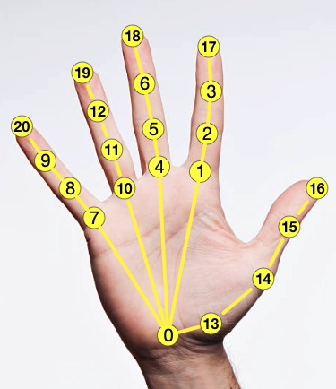

# Dexterous Hand Asset Processing

All the commands below run inside the `dexmachina/dexmachina/` directory. Please follow the steps in the exact order below, as many of them strictly depend on completing the previous step(s).

0. After the below processing steps, also need to run`retargeting/process_arctic.py` to get approximate contacts, this is done once for all object clips

## Inspect and Prepare URDFs
### 1. Clean up and inspect URDFs

I highly recommend this [URDF viewer](https://gkjohnson.github.io/urdf-loaders/javascript/example/bundle/index.html) -- very handy tool that lets you drag & drop a **folder** containing urdf files into your browser and visualize the robots. 
Run `inspect_raw_urdf.py` to get a sense of collision geometry, default joint ranges
Note that we only did a rough pass on the URDFs to make sure the masses are approximately reasonable, but not the inertials -- we rely on the `recompute_inertia` flag [here](https://github.com/Genesis-Embodied-AI/Genesis/blob/ca97a18b6b81fb7998fb36ead69761daf23241b1/genesis/engine/solvers/rigid/collider_decomp.py#L87) from Genesis to estimate the uniform-density link inertials. 

```
python hand_proc/inspect_raw_urdf.py --urdf_path assets/xhand/xhand_left_copy.urdf -v
```

### 2. Add 6dof wrist joints to the hand URDF

This is assuming the raw URDF file has a base link (typically the palm link, specified as `--base_link` in the script) and Run `add_wrist_dof.py`: 
```
python hand_proc/add_wrist_dof.py assets/xhand/xhand_left_copy.urdf xhand_left_6dof.urdf --dof_choices all --base_link left_hand_link 
```
You can also use the same script but a flag to only print out joint names, this is useful for writing the `target_joint_names` inside the retargeting config yaml in step 3 below.
```
python hand_proc/add_wrist_dof.py  assets/xhand/xhand_left_copy.urdf dummy.urdf --print_joint_names
```

### 3. Specify retargeting configs as yaml file

This should include the fingertip mapping from robot fingers to MANO keypoints. Use the keypoint convention on human hands from this image ([source](https://github.com/zc-alexfan/arctic/blob/master/docs/data/data_doc.md)):
The retarget config yaml file should look something like this (example from `dexmachina/dexmachina/assets/inspire_hand/retarget_config.yaml):
```
low_pass_alpha: 0.6
scaling_factor: 1.2
left:
  urdf_path: left_xyz_copy.urdf 
  target_origin_link: "base_link"
  human_origin_idx: 0  
  target_finger_links: [ "L_TH_Tip",  "L_FF_Tip", "L_MF_Tip", "L_RF_Tip", "L_LF_Tip"]
  human_finger_idxs: [16, 17, 18, 19, 20]  
  target_joint_names: ['L_TH_J1', 'L_TH_J2', 'L_FF_J1', 'L_MF_J1', 'L_RF_J1', 'L_LF_J1', 'L_forearm_tx_link_joint', 'L_forearm_ty_link_joint', 'L_forearm_tz_link_joint', 'L_forearm_roll_link_joint', 'L_forearm_pitch_link_joint', 'L_forearm_yaw_link_joint']
  wrist_body: "base_link"

right:
  [omitted]
```

### 4. Minimal Kinematic Re-targeting 

Run the below script to get reference trajs, which are needed for controller gain tuning, the files saved here are NOT used for rl envs.
```
python hand_proc/minimal_retarget.py --clip box-20-100 --hand inspire_hand # add --vis flag for visualizing the retargeted traj
```
Note here that we use the fingertip indexing convention following [arctic](https://github.com/zc-alexfan/arctic/tree/master) 

### 5. Specify collision groups
```
python hand_proc/inspect_raw_urdf.py --gather_geoms  --num_envs 1 --urdf_path assets/schunk_hand/schunk_hand_left_6dof.urdf --base_link_name left_hand_e1  
```
This script will automatically sort through the kinematic chain and find all the collision links that belong in either the palm group or one of the fingers' groups. Note that here we actually make a strong assumption that the left and right hand kinematics are symmetric: this is due to how we implemented a new group-based collision filtering in Genesis and it only supports one set of collison group for both hands in the same scene. This is sufficient for the current hands setup but might need improvements in the future. 

The collisoin grouping result from this script should be added to the `.py` config file inside `dexmachina/envs/hand_cfgs/` -- see instruction below: 

### 6. Add new hand config files to the existing code structure
- Add URDF and hand meshes to `dexmachina/dexmachina/assets`
- Add a new `.py` config file for simulation environments: for example, to add a new hand called `new_hand`, create `dexmachina/dexmachina/envs/hand_cfgs/new.py`, and specify urdf_path (make the `asset_dir` relative to `dexmachina/dexmachina/assets`), wrist_link_name, actuator parameters, collision_groups, following existing examples like `dexmachina/dexmachina/envs/hand_cfgs/inspire.py`.

Here's an annotated example for processing the Unitree 3-fingered dex3 hand. Create `dexmachina/dexmachina/envs/hand_cfgs/dex3.py`:

```
import os  
from os.path import join
from dexmachina.asset_utils import get_urdf_path

dex3_asset_dir = "dex3_hand/" 
left_rel_urdf = join(dex3_asset_dir, "dex3_left_6dof.urdf") # -> these files should be processed URDF with floating 6dof wrist joints  
right_rel_urdf = join(dex3_asset_dir, "dex3_right_6dof.urdf")

DEX3_LEFT_CFG={
    "urdf_path": get_urdf_path(left_rel_urdf),
    "wrist_link_name": "left_hand_palm_link", # this is the palm link 
    "kpt_link_names": ['left_hand_palm_link', 'left_hand_thumb_0_link', 'left_hand_middle_0_link', 'left_hand_index_0_link', 'left_hand_thumb_1_link', 'left_hand_middle_1_link', 'left_hand_index_1_link', 'left_hand_thumb_2_link'] 
    # These should be names of only collision links, find this from the output of running "hand_proc/inspect_raw_urdf.py --gather_geoms" from step 6 above
    "collision_groups": {7: 0, 11: 1, 12: 2, 13: 3, 14: 1}, # also output from step 6
    "collision_palm_name": "left_hand_palm_link",

    # for actuators, first put in all 0s as placeholders, then tune the controller gains following the instructions in the next section. This only needs to be done once and the kp/kv values are fixed after. 
    "actuators": {
      "finger": dict(
        joint_exprs=[".*0_joint", ".*1_joint", ".*2_joint"],
        kp=20.0,
        kv=1.5,
        force_range=50.0,
      ),
      "wrist_rot": dict(
            joint_exprs=[r'[LR]_forearm_(roll|pitch|yaw)_link_joint'],
            kp=80,
            kv=5.0,
            force_range=50.0,
        ),
        "wrist_trans": dict(
            joint_exprs=[r'[LR]_forearm_t[xyz]_link_joint'],
            kp=350,
            kv=12.0,
            force_range=50.0,
        ),
    },
}

DEX3_RIGHT_CFG=... # same structure as above, and use the same 'collision_groups' 
DEX3_CFGs=dict(
  left=DEX3_LEFT_CFG,
  right=DEX3_RIGHT_CFG,
)
```

- Make sure the new config contains both left and right side hands, and name it `NEW_CFGs` so the automatic import in `dexmachina/dexmachina/envs/robot.py` can find it.

- **Once you are done, run this test script to check the new robot config can be founded:** `python tests/test_new_hand_cfg.py --hand dex3_hand`

### 7. Tune controller gains 
See more details in section below. We default to give a 0.8 gravity compensation for all the hands. 


### 8. Run full-retargeting on ARCTIC demonstrations
Congrats, now the new hands are ready to use! We can now connect them with the existing (or your own) hand-object demonstration data and do policy training. Proceed to the next section for more details.

## Controller gain tuning 
 
### Prerequisites 
**A. Retargeting results from step 4 above**
Make sure you finished step 4 above, this will give you a reference trajectory from one of the ARCTIC demonstrations clips. Each clip is specified by both object and time-stamps, e.g. `hand_proc/retargeted/dex3_hand/waffleiron-40-300.pt`

**B. Specify joint groups**
Here we need `re` expressions that look up joint names. For now we group finger joints and wrist joints separately, i.e. a total of 3 groups. 
If you used the `add_wrist_dof.py` script from step 2, the wrist translation joints and rotation joints should be named the same, the `joint_exprs=[r'[LR]_forearm_(roll|pitch|yaw)_link_joint']` and `joint_exprs=[r'[LR]_forearm_t[xyz]_link_joint']` can be re-used across different dex hands. 
Exact steps and what to look for when you tune controller gains:

**C. Tune the joints by group.** Repeat the steps 1-2 below for all the joint groups, and follow this order: `wrist_trans` -> `wrist_rot` -> `finger`. When you tune one group, set the gains for the *un-tuned* groups to zeros (e.g. when you tune `wrist_rot`, set the `finger` groups' `kp/kv` to 0s in the `hand_cfgs/xx.py` file.)
 
**D. Have a monitor display** Need screen display for visually inspect the joint behaviors.

### 1. Tune kp

First tune `kp` and set kv to 0. Look at the speed at which the controller corrects itself to reach the target. You will see oscillation, but the amplitude and frequency of this vibration should be within a reasonable range of how fast the real robot can go, and the the joint should always center around the target.

Example command:
```
python hand_proc/tune_gains.py --hand dex3_hand -B 2 -v --joint_group wrist_trans  --kp 50 1000 --kv 0 0  -fr 100.0 100.0 --clip waffleiron-40-300 --freespace --step_interp 1 --step_response --skip_object
```

### 2. Tune kv
Next tune `kv`: fix the kp and start with a _large_ range of kv: a typical first pass is [.1, 1, 100, 1000]. Now you don't want any oscillation: a good kv should make the controller steadily but still quickly go straight to the target. If it's too high the joint will be too slow or cannot fully reach the target, if it's too low the joint will still oscillate. 

Example command for single step tuning (Note that this script assumes you have on-screen display!)
```
python hand_proc/tune_gains.py --hand dex3_hand -B 2 -v --joint_group wrist_trans  --kp 300 300 --kv 1 50  -fr 100.0 100.0 --clip waffleiron-40-300 --freespace --step_interp 1 --step_response --skip_object
```

### 3. Control the full trajectory 
Once the single step looks good, use the tuned parameters to control the full reference trajectory to see if it follows the demo well. Notice here the gain ranges are now fixed.
```
python hand_proc/tune_gains.py --hand dex3_hand -B 2 -v --joint_group finger  --kp 100 100 --kv 6 6   -fr 100.0 100.0 --clip waffleiron-40-300 --freespace  --skip_object
```
